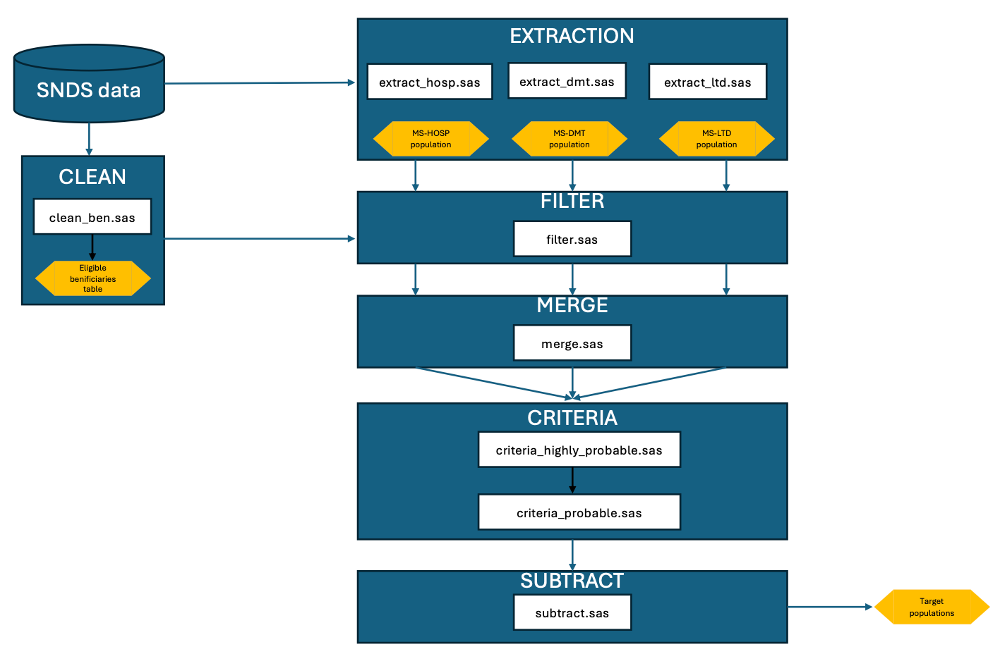

# **MS Incidence Extraction in the SNDS**

## **1. Project Overview**

Multiple sclerosis (MS) is a chronic neurological condition that stands as the leading cause of non-traumatic neurological disability in young adults. Accurate identification of incident MS cases is essential to comprehending its epidemiology and monitoring evolving trends, especially given the recent changes in diagnostic criteria. Although the global prevalence of MS is on the rise, recent temporal trends in its incidence are less clear.

This project leverages the French National Health Data System (SNDS) to study the temporal trends in MS incidence. The SNDS provides several advantages:

1. Since 2009, it covers 99% of the French population.
2. It contains comprehensive data on MS-related disease-modifying therapies, hospital discharge codes, and benefits for long-term illnesses associated with MS.

These strengths enable robust identification and offer high generalizability. However, studying MS incidence can be challenging due to the absence of direct access to patient medical records. Consequently, patients with primary progressive MS or "benign" MS, who may not undergo treatment or have long-term benefits, might remain unrecorded until a complication occurs that necessitates hospitalization or the prescription of a disease-modifying therapy. This project aims to refine methods to assess the accuracy of MS case recording within the database; for example, by defining a sensitive and a specific definition of our MS case-finding algorithm.

## **2. Code Organization**

The SAS code is structured to follow a specific workflow to ensure accurate data processing and analysis. The key steps are outlined below, and the detailed flow is illustrated in the accompanying `DATA_FLOW.pdf`:

1. **CLEAN**
   - *File*: `clean_ben.sas`
   - This step involves initial cleaning of beneficiary data to identify eligible individuals.

2. **EXTRACT**
   - *Files*: `hosp_06_08.sas`, `dmt_06_08.sas`, `ltd.sas`, `hosp_09_23.sas`, `dmt_09_23.sas`
   - Extraction of relevant data from various sources, including hospital records, disease-modifying therapies (DMT), and long-term benefits (LTD).

3. **FILTER**
   - *File*: `filter.sas`
   - Applying initial filters to narrow down the dataset based on key criteria.

4. **MERGE**
   - *File*: `merge.sas`
   - Merging datasets to create a unified dataset containing relevant MS-related information.

5. **CRITERIA**
   - *Files*: `criteria_highly_probable.sas`, `criteria_probable.sas`
   - Applying specific criteria to categorize cases as highly probable or probable MS incidents.

6. **SUBTRACT**
   - *File*: `subtract.sas`
   - Identifying and removing non-target populations to refine the final dataset of MS cases.

## **3. Setup and Execution**

### **Prerequisites**
- SAS software installed and configured.
- Access to the SNDS dataset, with appropriate permissions.

## **4. References**

- Code for drug and hospital discharge extractions were adapted from [HAS Programmes-SNDS Repository.](https://gitlab.has-sante.fr/has-sante/public/programmes-snds)
